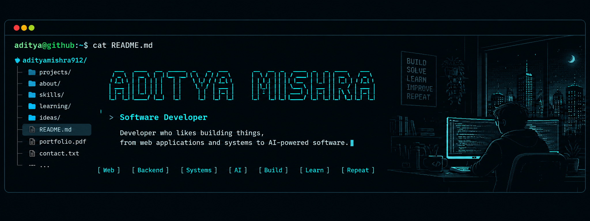

<!-- ======================= COVER ======================= -->

  

 

<!-- ======================= NAME ======================= -->

<h1 align="center">Aditya Mishra</h1>

  <strong>Software Developer</strong>

  Developer who likes building things, from web applications and systems to AI-powered software.

  <a href="https://www.linkedin.com/in/adityamishra912">LinkedIn</a>
  &nbsp; • &nbsp;
  <a href="https://github.com/adityamishra912">GitHub</a>
  &nbsp; • &nbsp;
  <a href="https://leetcode.com/u/adityamishra0912/">LeetCode</a>

 

---

<!-- ======================= ABOUT ME ======================= -->

<h2 align="center">About Me</h2>

 

🎓 B.Tech CSE @ LNCT, Bhopal
🤖 Exploring LLMs, RAG & Agentic AI  
🛠️ Building full-stack applications and systems

 

---

<!-- ======================= WHAT I BUILD ======================= -->

<h2 align="center">What I Build</h2>

 

<table align="center">
<tr>
<td align="center" width="25%">

### 🌐
### Web Applications

Full-stack applications, platforms and dashboards

</td>

<td align="center" width="25%">

### ⚙️
### Backend Systems

APIs, databases, authentication and integrations

</td>

<td align="center" width="25%">

### 🤖
### AI Applications

LLM-powered applications, RAG pipelines and agentic workflows

</td>

<td align="center" width="25%">

### 🔬
### Experiments

Research, prototypes and technical projects

</td>
</tr>
</table>

 

---

<!-- ======================= TECH STACK ======================= -->

<h2 align="center">Tech Stack</h2>

 

<h3 align="center">Languages</h3>

  

  <strong>Java · Python · JavaScript · TypeScript · SQL</strong>

 

<h3 align="center">Frontend</h3>

  

  <strong>React · Next.js · Tailwind CSS</strong>

 

<h3 align="center">Backend</h3>

  

  <strong>Node.js · Express.js · Spring Boot · FastAPI · REST APIs</strong>

 

<h3 align="center">Databases</h3>

  

  <strong>MySQL · PostgreSQL · MongoDB · Firebase Firestore</strong>

 

<h3 align="center">AI Engineering</h3>

  

  <strong>LLMs · RAG · AI Agents · Agentic AI · LangChain · LangGraph · Gemini API · Hugging Face · Transformers</strong>

 

<h3 align="center">Cloud & Tools</h3>

  

  <strong>Vercel · Render · Hugging Face Spaces · Hostinger · Docker · Git · GitHub · Linux</strong>

 

---

<!-- ======================= SOCIAL LINKS ======================= -->

<h2 align="center">Connect With Me</h2>

 

 

---

<!-- ======================= CURRENTLY LEARNING ======================= -->

<h2 align="center">Currently Learning</h2>

 

🤖 <strong>LLM Application Development</strong>

🔎 <strong>RAG & Retrieval Systems</strong>

🧠 <strong>Agentic AI</strong>

🔗 <strong>Multi-Agent Systems</strong>

🏗️ <strong>System Design</strong>

 

